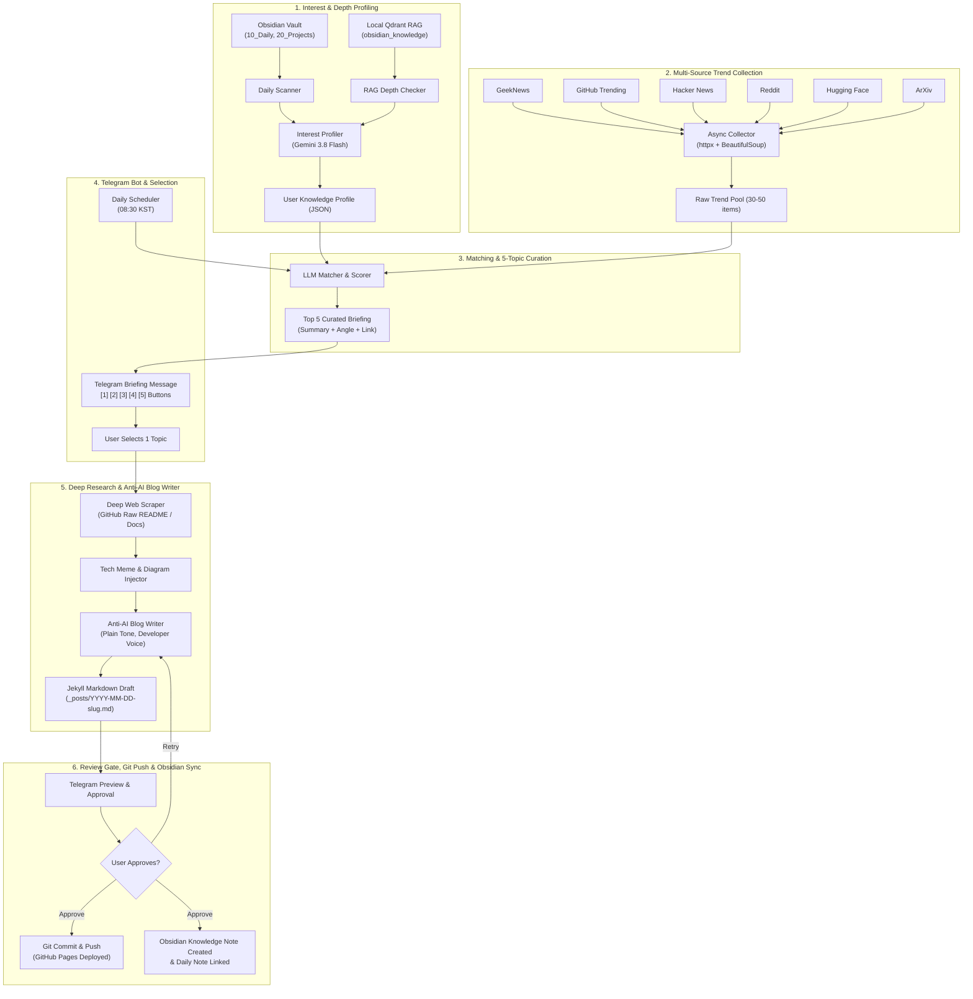

# 🚀 Tech Trend Curation & Anti-AI Blog Automator

> **Curate personalized daily tech trends from global sources using your Obsidian knowledge graph & RAG depth, and generate witty, humorous, "anti-AI" developer blog posts with one-click GitHub Pages publishing.**

---

## 📌 Overview

Most AI-generated blog posts sound robotic, predictable, and devoid of personality. At the same time, keeping up with the overwhelming flood of tech news (GitHub, Hacker News, ArXiv, Reddit, GeekNews) takes hours of manual filtering.

**Tech Trend Blog Automator** bridges this gap:
1. **Profiles your real interests and knowledge depth** by scanning your local **Obsidian Vault** (diaries, active projects) and querying your local **Qdrant RAG** system to filter out trivial beginner topics you already know.
2. **Concurrently scrapes 6 global tech trend sources** (GeekNews, GitHub Trending, Hacker News, Reddit, Hugging Face, ArXiv).
3. **Curates the Top 5 most relevant, high-impact topics** and delivers an interactive briefing card to your **Telegram Bot**.
4. **Deeply researches your selected topic** (fetching raw GitHub READMEs, docs, and community reactions).
5. **Drafts a witty, plain-tone developer blog post** equipped with tech memes, architecture diagrams, and real-world code blocks—strictly adhering to an **"anti-AI"** writing style (no generic intros, no hollow conclusions, pure senior engineer voice).
6. **Human-in-the-Loop Git publishing**: You preview the draft on Telegram and tap `[🚀 Approve & Push]` to publish to **GitHub Pages** while automatically syncing back a structured knowledge note with wikilinks into your **Obsidian Vault**.

---

## 🏗️ Architecture


> 💡 **Interactive Architecture Viewer**: Open [`docs/architecture.html`](docs/architecture.html) in your browser to explore the diagram interactively with zoom, pan, focus views, and dark/light mode!

<details>
<summary><b>Click to expand Mermaid text flowchart</b></summary>



</details>


---

## ✨ Pros & Key Advantages

- **Deep Personalization (RAG-Backed)**: Unlike generic newsletter bots, this engine knows what you built yesterday. It skips "What is Docker?" or "Intro to Vector DB" and targets advanced topics aligned with your current projects.
- **True Multi-Channel Coverage**: Concurrently aggregates from Korean tech media (GeekNews), global developer feeds (GitHub, Hacker News, Reddit), and cutting-edge research (Hugging Face, ArXiv).
- **"Anti-AI" Developer Voice**: Eliminates cliché AI phrases (*"In today's fast-evolving technological landscape..."*). Writes in punchy, candid, humorous developer Korean (`~했다`, `~다`, `~인 셈이다`) with relatable dev memes and Mermaid diagrams.
- **Strict Human-in-the-Loop Safety**: Zero surprise commits. Posts are drafted locally and require explicit Telegram approval before pushing to Git.
- **Bidirectional Second-Brain Sync**: Keeps your blog and Obsidian vault in sync. Every published post generates a companion resource note in Obsidian cross-linked with your daily logs.
- **Model Agnostic & Fallback Resilient**: Uses Google's latest **Gemini 3.8 Flash** with automatic cascading fallbacks (`3.8` → `3.7` → `3.6`), and supports OpenAI or local **Ollama** models.

---

## ⚠️ Limitations & Considerations (Cons)

- **Reddit Scraping Sensitivity**: Reddit's public JSON API occasionally enforces IP-level rate limits (403 Forbidden). The system gracefully continues using the other 5 sources if Reddit is blocked.
- **Jekyll Post Structure Default**: The writer formats frontmatter specifically for Jekyll (`_posts/YYYY-MM-DD-title.md`). Users on Astro or Hugo may need minor template adjustments in `src/writer/blog_writer.py`.
- **Requires Running Daemon for Instant Button Handling**: The Telegram bot process must be running in the background (or scheduled via Windows Task Scheduler / systemd) to listen for inline button clicks.

---

## 🛠️ Installation Guide

### 1. Prerequisites
- **Python 3.10+** (Tested on Python 3.13)
- **Git**
- A **Telegram Bot Token** (Free via [@BotFather](https://t.me/BotFather))
- A **Google Gemini API Key** (Free via [Google AI Studio](https://aistudio.google.com)) or an OpenAI API Key

### 2. Clone the Repository
```bash
git clone https://github.com/yourusername/tech-trend-blog-automator.git
cd tech-trend-blog-automator
```

### 3. Set Up Virtual Environment & Dependencies
```bash
# Windows (PowerShell)
python -m venv .venv
.\.venv\Scripts\Activate.ps1
pip install -r requirements.txt

# Linux / macOS
python3 -m venv .venv
source .venv/bin/activate
pip install -r requirements.txt
```

---

## ⚙️ Configuration (`.env`)

Copy `.env.example` to `.env`:
```bash
cp .env.example .env
```

Edit `.env` with your settings:

```env
# ==============================================================================
# Telegram Settings
# ==============================================================================
# 1. Get from @BotFather on Telegram
TELEGRAM_BOT_TOKEN=123456789:ABCdefGhIJKlmNoPQRsTUVwxyZ
# 2. Your Telegram Chat ID (send /start to your bot to see your ID)
TELEGRAM_CHAT_ID=123456789
# 3. Daily scheduled notification time (24-hour format HH:MM)
SCHEDULE_TIME=08:30

# ==============================================================================
# LLM Settings
# ==============================================================================
# Free API key from https://aistudio.google.com
GEMINI_API_KEY=AIzaSy...
GEMINI_MODEL=gemini-3.8-flash
# Optional: OpenAI API Key
OPENAI_API_KEY=

# ==============================================================================
# Local Paths & Blog Configuration
# ==============================================================================
# Path to your Obsidian Vault root
OBSIDIAN_VAULT_PATH=C:/Users/username/Documents/Obsidian
# Path to your GitHub Pages Jekyll repository root
BLOG_REPO_PATH=C:/Users/username/projects/username.github.io
# Base URL for your published blog
BLOG_BASE_URL=https://username.github.io

# ==============================================================================
# Local Qdrant RAG Service (Optional)
# ==============================================================================
QDRANT_RAG_URL=http://localhost:8765
```

---

## 📖 Usage Guide

### 1. Dry-Run Pipeline Test (CLI)
Run a complete end-to-end dry-run without sending Telegram messages or committing to Git:
```bash
python main.py test-pipeline
```
This will:
- Profile your Obsidian vault
- Concurrently scrape all 6 trend sources
- Curate the Top 5 topics
- Generate a sample blog post draft in `_posts/`

### 2. Send Instant Briefing to Telegram
Trigger an immediate briefing to your Telegram chat right now:
```bash
python main.py send-briefing
```

### 3. Run the Telegram Bot & Daily Scheduler
Start the persistent background bot:
```bash
python main.py bot
```
- The bot will poll for button interactions.
- Every day at `SCHEDULE_TIME` (e.g. `08:30`), it automatically dispatches your 5-topic briefing.

---

## 📱 Telegram Commands & Workflow

1. Send `/start` to your bot to verify connection and inspect your `chat_id`.
2. Send `/now` or `/trend` anytime to receive an on-demand Top 5 briefing.
3. Tap any **`[1번 선택]` ~ `[5번 선택]`** button:
   - The bot investigates the topic via deep web scraping.
   - It drafts the post and sends back a preview with approval buttons.
4. Tap **`[🚀 배포 승인 (Push)]`**:
   - Executes `git add`, `git commit`, and `git push` to your GitHub Pages repo.
   - Creates a structured knowledge note in Obsidian `40_Resources/42_기술_학습_위키/` and links it to today's daily note.

---

## 🔒 Security & Privacy Audit

When publishing this repository publicly:
- **`.env` is strictly ignored** via `.gitignore`. Never commit `.env` or API keys.
- **No hardcoded credentials or local usernames**: All paths and tokens are dynamically resolved via `config.py` and environment variables.
- **Local-first data handling**: Your Obsidian vault contents are processed locally; only anonymized interest keywords and scraped public web data are submitted to the LLM API.

---

## 📄 License

This project is licensed under the [MIT License](LICENSE).
