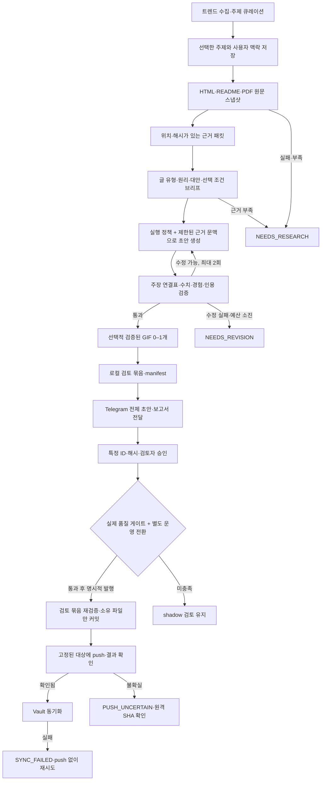

# 현재 아키텍처 — 2026-10-08

이 문서는 근거 중심 리팩토링 이후의 실행 경로를 설명한다. 구현·검증 상태는 [refactor-status.md](refactor-status.md), 평가 조건은 [editorial-evaluation.md](editorial-evaluation.md)에 기록한다. 코드 병합과 푸시는 블로그 발행이나 운영 전환을 뜻하지 않는다.

## 생성부터 발행까지

품질·운영 전환 게이트는 Telegram 경로에 적용된다. CLI 발행은 별도의 운영자 경로이며 승인된 초안 ID·해시를 요구한다. 평가 중 CLI를 실제 블로그·Vault 경로에 실행하지 않는다.

## 구성 요소

| 책임 | 현재 코드 | 보존하는 정보·판단 |
| --- | --- | --- |
| 수집·선별 | `src/collector/`, `src/curator/matcher.py` | 후보와 채택 질문; 큐레이션 결과는 검증된 글이 아님 |
| 사용자 맥락 | `src/profiler/`, `src/editorial/store.py` | 목표·제약·관심의 출처, 선택한 주제, 명시적 실행 로그의 바이트; Vault 관심은 직접 경험으로 승격하지 않음 |
| 원문·근거 | `src/research/fetch.py`, `extract.py`, `packet.py` | 원문 바이트·텍스트, URL·수집 시각·해시·절/페이지 위치; 수치 조건은 같은 실험 범위에서 연결 |
| 편집 판단 | `src/editorial/brief.py` | `paper`, `tool`, `protocol`, `design_comparison`; 원리·대안·제약·판단을 뒤집을 조건. 논문에 없는 ablation은 만들지 않음 |
| 작성·검증 | `src/editorial/draft.py`, `validate.py`, `policy.md` | 출처 ID를 유지한 주장 연결표, 수치 비교 조건, 경험 근거, 최대 두 번의 부분 수정 |
| 미디어 | `src/editorial/media.py`, `assets/memes/catalog.json` | 실제 장면·alt·바이트 해시·사용 조건; 적합한 GIF가 없으면 생략 |
| 검토·승인 | `src/editorial/pipeline.py`, `store.py`, `src/bot/telegram_bot.py` | 전체 본문·근거·브리프·검증·미디어와 manifest; 재시작해도 같은 입력 유지, 재생성하면 이전 승인 무효 |
| 발행·복구 | `src/publisher/git_publisher.py`, `obsidian_sync.py` | 해당 초안 파일만 커밋, 실제 push 목적지·브랜치 결과 확인, 발행 기록과 동기화 결과 분리 |
| 평가·출시 게이트 | `scripts/evaluate_drafts.py`, `tests/fixtures/evaluation/` | 고정 입력 replay, 재현 불가 사유, 익명 평가 묶음과 해시에 연결된 사람 평가 |

`src/writer/blog_writer.py`와 `deep_researcher.py`는 새 경로의 호환 어댑터다. 유지보수 규칙은 [AGENTS.md](../AGENTS.md), 모델에 실제 전달되는 문체·근거 규칙은 [policy.md](../src/editorial/policy.md)에 둔다.

## 상태와 복구

- `NEEDS_RESEARCH`: 원문·핵심 사실·수치 조건을 보강해 새 검토를 생성한다. 오류를 대체 글로 덮지 않는다.
- `NEEDS_REVISION`: 주장 연결이나 생성·검증 실패를 확인한다. 수정 한도 이후에는 사람이 근거·브리프를 고쳐 다시 생성한다.
- `REVIEW_READY → APPROVED`: 검토 묶음과 본문 해시를 확인한다. 승인만으로 Git·Vault를 쓰지 않는다. 승인된 묶음은 직접 편집하지 않는다.
- `PUSH_UNCERTAIN`: 같은 커밋을 무작정 다시 push하지 않고 해당 원격·브랜치 SHA를 확인한다. 확인 전에는 Vault를 동기화하지 않는다.
- `PUBLISHED` 이후 `SYNC_FAILED`: 발행 성공을 유지하고 Vault만 재시도한다. 자동 Vault 색인은 수행하지 않는다.

## 현재 운영 경계

기본값은 `EDITORIAL_SHADOW_MODE=true`, `EDITORIAL_CUTOVER_AUTHORIZED=false`, 품질 보고서 미지정이다. 실제 사람 평가와 여러 글 유형의 품질 게이트가 필요하다. 합성 fixture는 이 게이트를 통과할 수 없다. 수치·주장 검증은 연결된 근거를 검사하며 원저자 실험의 과학적 타당성까지 증명하지 않는다.

과거 글 8편은 당시 생성 입력이 없어 동일 조건 재현이 불가능하다. 실제 모델 ablation, 사람의 문체·깊이·판단 평가, 토큰·시간·비용·밈 적합성은 아직 미측정이다. 기존 GIF 8개는 장면을 확인했지만 출처·사용 조건이 확인되지 않아 제외한다.

## 과거 다이어그램

[architecture.json](architecture.json), [architecture.html](architecture.html), [architecture-diagram.png](architecture-diagram.png)는 리팩토링 이전 자료다. JSON 메타데이터와 HTML 첫 화면에 이 사실을 표시하며 PNG는 원본 기록으로 보존한다. 이 자료의 모델명·RAG 설명·직접 작성/발행 화살표를 현재 계약으로 사용하지 않는다. HTML에서 새로 내보낸 이미지도 과거 흐름을 담는다.

## Durable natural-language entry

Repository `.agents/skills/blog-workflow/SKILL.md` routes supported requests to
`main.py` JSON commands and `src/workflow/service.py`; it retains `run_id` and
publication scope. `RunStore` freezes completed checkpoints, revision directives,
review delivery/approval and publication targets. CLI and Telegram share this
authorization. Default Vault topic requests use configured Telegram `briefing`;
local `request --reviewer` is optional. See [the command and receipt contract](natural-language-workflow.md).

Resume retries incomplete stages and previously reserved publication targets.
Confirmed Git publication can retry Vault sync independently. A shadow run needs
explicit exact one-post trial authorization; production retains quality/cutover
gates. Telegram acceptance before its local delivery checkpoint can cause repeat
delivery after restart. Receipt evaluation separates system failures, routine
operator choices and editorial/recovery interventions; it supplies no human ratings.
