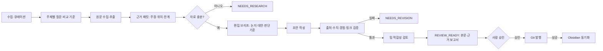

# 근거 중심 기술 블로그 자동화 설계

## 목적과 독자

한국어로 글을 읽는 실무 개발자를 대상으로, 기술의 작동 원리와 채택 판단을 검증할 수 있는 글을 만든다. 문체는 담백한 평어체를 기본으로 하고, 유머와 밈은 내용에 맞을 때만 사용한다. 자동화의 산출물은 발행물이 아니라 검토 가능한 초안이다.

## 현재 구조에서 확인한 문제

- `src/writer/deep_researcher.py`는 기본적으로 선택된 URL 하나만 읽는다. HTML은 앞부분의 줄만 보존하고, PDF는 본문을 읽지 않고 주제 요약을 반환한다.
- `src/writer/blog_writer.py`는 원문 일부를 단일 프롬프트에 넣어 곧바로 완성형 글을 요청한다. 자료의 주장, 추론, 사용자 경험을 구분하는 자료 구조가 없다.
- 같은 파일의 실패 대체 템플릿은 조사 실패를 발행 가능한 문장으로 포장한다. `[MEME_1]`, `[MEME_2]`를 강제하며 두 밈은 무작위로 고른다.
- `src/writer/meme_manager.py`는 GIF의 실제 장면을 설명하는 메타데이터가 없고, 설명 문구를 그대로 alt와 중복 캡션에 쓴다.
- `src/profiler/rag_checker.py`는 현재 지식 검색 데몬을 질의하지 않고 Vault 문자열 검색을 수행한다. `src/profiler/interest_profiler.py`는 오류 시 고정된 관심사와 경험 수준을 반환하므로 개인화된 판단의 근거로 쓰기 어렵다.
- `src/bot/telegram_bot.py`의 승인은 500자 미리보기 이후 곧바로 push로 이어지고, `GitPublisher`의 실패 여부와 무관하게 Obsidian 동기화와 성공 메시지로 진행한다. 현재 프로세스의 `last_draft` 하나만 보관한다.
- 테스트 모음은 없으며 `main.py test-pipeline`은 실제 외부 API와 블로그 경로에 의존하고 초안 파일을 쓴다.

## 핵심 원칙

1. 주장 하나가 원문, 직접 측정, 명시한 추론 중 어디에서 왔는지 추적할 수 있어야 한다.
2. 자료가 빈약하거나 상충하면 `NEEDS_RESEARCH`로 멈춘다. 오류나 API 실패를 완성형 글로 대체하지 않는다.
3. 직접 해보지 않은 일을 일인칭 경험으로 쓰지 않는다. 사용자 노트는 관심사와 제약 조건을 알려줄 뿐, 공개 가능한 경험의 증거로 자동 승격하지 않는다.
4. 논문·제품의 벤치마크는 원저자의 주장으로 표기하고 비교 조건을 함께 쓴다. 재현 실험이나 ablation이 없으면 만들지 않는다.
5. 기술별 적합성을 조건부로 판단한다. 무엇을 비교했는지, 무엇을 우선했는지, 어떤 관찰이 결론을 뒤집을지 적는다.
6. 밈은 선택 사항이다. 실제 미디어에 보이지 않는 장면이나 대사를 설명하지 않는다.
7. 사람이 전체 초안과 근거 보고서를 확인한 뒤 발행한다. 발행과 Vault 쓰기는 명시적인 승인 이후에만 수행한다. Vault 증분 색인은 이 파이프라인의 일부가 아니다.

## 자료 흐름

## 계약과 산출물

- `SourceRecord`: URL, 문서 종류, 수집 시각, 제목, 원문 해시, 본문, 섹션/페이지 위치, 수집 오류. URL 하나당 하나의 기록.
- `EvidenceClaim`: 문장, 종류(`source_claim`, `measurement`, `inference`, `hypothesis`), 출처 위치, 확인 상태. 수치에는 값·단위·대상·baseline·측정 조건을 추가한다.
- `ResearchPacket`: 주제 질문, 원문 목록, 근거 주장, 반례·한계, 남은 질문. 인용 가능한 원문이 없는 경우 생성하지 않는다.
- `UserContext`: 사용자가 명시한 목표·제약과 Vault에서 발견한 관심 주제를 출처별로 구분한다. 실제 사용 경험은 사용자가 공개를 허락한 기록과 실행 로그가 있을 때만 별도로 첨부한다.
- `EditorialBrief`: 독자, 핵심 논지, 비교 대안, 작동 원리, 선택 기준, 판단을 뒤집을 조건, 글 유형.
- `DraftArtifact`: 초안 식별자, 원본 주제, 근거 패킷 식별자, 본문 경로, 검사 결과, 상태, 미디어 목록. 상태는 `NEEDS_RESEARCH` → `NEEDS_REVISION` 또는 `REVIEW_READY` → `APPROVED` → `PUBLISHED`로 이동한다. 실패 상태는 우회하지 않는다.
- 모든 중간 결과는 로컬에서 재검토할 수 있게 JSON과 Markdown으로 남긴다. 비밀키와 Vault 원문 전체를 기록하지 않는다.

## 글 유형별 깊이

| 유형 | 필수 분석 | 숫자·ablation 처리 |
| --- | --- | --- |
| 논문·벤치마크 | 문제, 방법, baseline, 실험 조건, 결과, 실패 사례 | 논문의 표와 ablation을 원문 위치와 함께 재구성한다. 없는 실험은 없다고 쓴다. |
| 라이브러리·도구 | 핵심 API/코드 경로, 기존 대안, 도입 비용, 적합한 작업 | 직접 재현할 수 있을 때만 작은 동일 조건 실험을 수행한다. 미실행이면 검증 계획만 쓴다. |
| 프로토콜·표준 | 위협 모델/요구사항, 메시지 흐름, 구현 상태, 호환성 | 속도 개선 같은 숫자를 강제하지 않는다. 요구사항별 대안 비교를 쓴다. |
| 설계 비교 | 부하/장애/운영 제약, 대안별 장단점, 선택 경계 | 비교 조건을 표로 고정한다. 자체 측정이 없다면 추정치를 측정값처럼 쓰지 않는다. |

## 글의 형태와 목소리

고정된 소제목 템플릿은 두지 않는다. 첫 부분에서 실제 문제와 쟁점을 밝히고, 중간에서 원리와 증거를 보여주며, 끝에서 조건부 선택을 제시한다. 글마다 독자가 가져갈 수 있는 구체적인 구현 정보 또는 판단 기준이 있어야 한다. 제목과 도입에 가상의 밤샘·영수증·프로덕션 장애 경험을 만들지 않는다. 드문 유머는 관찰한 사실이나 실제 트레이드오프에서 나오게 한다.

## 미디어 정책

`assets/memes`의 GIF를 실제로 확인한 뒤, 파일별로 보이는 내용, 어울리는 상황, 출처/사용 조건, alt 문구를 등록한다. 초안의 특정 문맥과 맞는 미디어가 없으면 0개를 사용한다. 한 글에 최대 1개를 기본으로 하되, 배치 자체가 정보 전달을 방해하면 삭제한다. alt는 접근성을 위한 실제 장면 설명이며, 본문에 동일한 캡션이나 가상의 대사를 붙이지 않는다. 코드/표/도식이 설명에 더 적합하면 그것을 우선한다.

## 검증과 발행

정적 검사는 출처 링크, 수치의 출처·조건, 일인칭 경험 표식, 이미지 파일/alt, frontmatter, 금지된 placeholder를 점검한다. 정적 검사만으로 진위를 확정하지 않고 근거 대조 검토를 추가한다. 둘 중 하나가 실패하면 `REVIEW_READY`로 올리지 않는다. Telegram은 전체 파일 링크와 짧은 품질 보고서를 보여주고, 승인은 특정 초안 ID와 해시에 묶는다. 승인 후 파일이 바뀌면 승인을 무효화한다. Git push 성공 후에만 Vault 노트를 만들며 각 결과를 따로 보고한다. 이미 push에 성공한 뒤 Vault 동기화만 실패했다면 재시도 가능한 실패로 기록한다.

## 품질 평가

현행 글 8~12개를 먼저 고정 평가 세트로 만들고 기준값을 측정한다. 새 글은 동일한 주제·자료로 생성해 블라인드 평가한다. 자동 점검 지표는 근거 없는 핵심 주장 수, 출처를 찾을 수 없는 수치 수, 가짜 일인칭 경험 수, 깨진 미디어 수, 비용·시간이다. 사람 평가는 기술적 깊이, 판단의 재현 가능성, 자연스러움, 유머 적합성을 각각 1~5점으로 기록한다. 릴리스 기준은 가짜 경험·출처 없는 핵심 수치·상상한 밈 설명·깨진 링크가 각각 0건이고, 깊이와 판단 평균이 각각 4/5 이상인 것이다. 작은 표본의 평균 향상은 통계적 유의성을 주장하지 않는다.

파이프라인 자체의 기여도는 동일한 입력·모델·예산에서 `현행`, `근거 패킷 추가`, `근거 패킷+검증`, `전체 흐름`을 비교한다. 각 단계가 어떤 실패 유형을 줄였는지 확인하고, 비용이 큰데 효과가 없는 단계는 제거한다. 이 내부 ablation과 글 주제에 대한 기술적 ablation은 구분한다.

## 이행 경계

기존에 발행된 글은 자동 수정하지 않는다. 우선 오프라인 fixture와 임시 블로그 디렉터리에서 새 경로를 검증하고, 기존 Telegram 승인 흐름을 새 `DraftArtifact`에 연결한다. 실제 블로그 repo와 Vault에는 명시적인 사용자 승인 전까지 쓰지 않는다. 단계별 기능 플래그로 이전 생성 경로를 다시 사용할 수 있게 유지하되, 이전 경로의 결과는 품질 통과 초안으로 표시하지 않는다.
